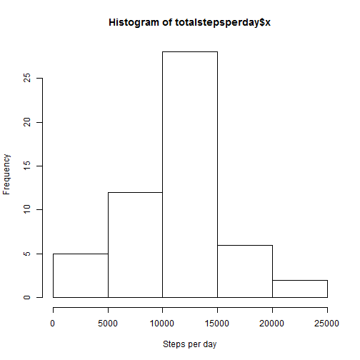
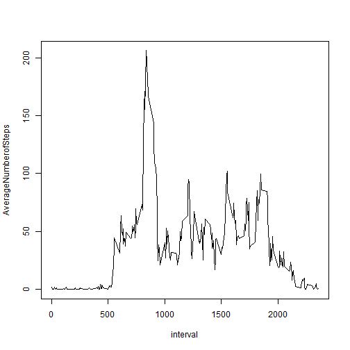
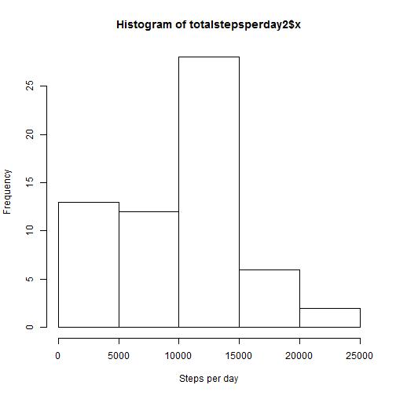
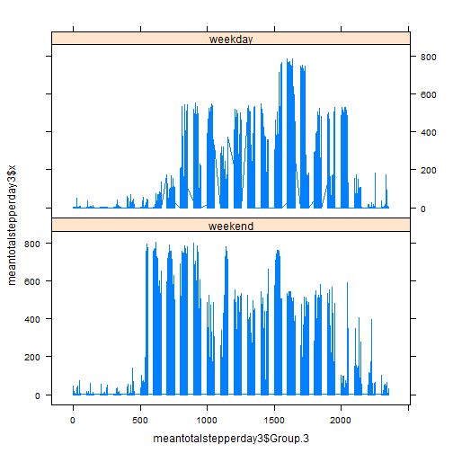

## Loading and preprocessing the data


```r
data <- read.csv(unz("activity.zip","activity.csv"))

data_unaltered <- read.csv(unz("activity.zip","activity.csv"))

data_type<-as.Date(data$date,"%Y-%m-%d")

data$time_type <- data_type


newdata<- data[complete.cases(data),]
```


## What is mean total number of steps taken per day?

```r
totalstepsperday <- aggregate(newdata$steps,by=list(newdata$time_type),FUN=sum)
meantotalperday <-aggregate(newdata$steps,by=list(newdata$time_type),FUN=mean)


meanperday <-mean(totalstepsperday$x)
meanperday
```

```
## [1] 10766.19
```

```r
medianperday <- median(totalstepsperday$x)
medianperday
```

```
## [1] 10765
```

```r
val<- as.character(meanperday)
val2 <- medianperday
```


the mean is 10766.1886792453
the mean is 1.0766189 &times; 10<sup>4</sup>
the median is 10765


The histogram

```r
hist(totalstepsperday$x,xlab="Steps per day")
```

 

```r
mediantotalperday <-aggregate(newdata$steps,by=list(newdata$time_type),FUN=median)

newdata2 <-meantotalperday
newdata2$median <- mediantotalperday$x
colnames(newdata2)[2]<-"Meantotalperday"
colnames(newdata2)[1]<-"Date"
print(newdata2)
```

```
##          Date Meantotalperday median
## 1  2012-10-02       0.4375000      0
## 2  2012-10-03      39.4166667      0
## 3  2012-10-04      42.0694444      0
## 4  2012-10-05      46.1597222      0
## 5  2012-10-06      53.5416667      0
## 6  2012-10-07      38.2465278      0
## 7  2012-10-09      44.4826389      0
## 8  2012-10-10      34.3750000      0
## 9  2012-10-11      35.7777778      0
## 10 2012-10-12      60.3541667      0
## 11 2012-10-13      43.1458333      0
## 12 2012-10-14      52.4236111      0
## 13 2012-10-15      35.2048611      0
## 14 2012-10-16      52.3750000      0
## 15 2012-10-17      46.7083333      0
## 16 2012-10-18      34.9166667      0
## 17 2012-10-19      41.0729167      0
## 18 2012-10-20      36.0937500      0
## 19 2012-10-21      30.6284722      0
## 20 2012-10-22      46.7361111      0
## 21 2012-10-23      30.9652778      0
## 22 2012-10-24      29.0104167      0
## 23 2012-10-25       8.6527778      0
## 24 2012-10-26      23.5347222      0
## 25 2012-10-27      35.1354167      0
## 26 2012-10-28      39.7847222      0
## 27 2012-10-29      17.4236111      0
## 28 2012-10-30      34.0937500      0
## 29 2012-10-31      53.5208333      0
## 30 2012-11-02      36.8055556      0
## 31 2012-11-03      36.7048611      0
## 32 2012-11-05      36.2465278      0
## 33 2012-11-06      28.9375000      0
## 34 2012-11-07      44.7326389      0
## 35 2012-11-08      11.1770833      0
## 36 2012-11-11      43.7777778      0
## 37 2012-11-12      37.3784722      0
## 38 2012-11-13      25.4722222      0
## 39 2012-11-15       0.1423611      0
## 40 2012-11-16      18.8923611      0
## 41 2012-11-17      49.7881944      0
## 42 2012-11-18      52.4652778      0
## 43 2012-11-19      30.6979167      0
## 44 2012-11-20      15.5277778      0
## 45 2012-11-21      44.3993056      0
## 46 2012-11-22      70.9270833      0
## 47 2012-11-23      73.5902778      0
## 48 2012-11-24      50.2708333      0
## 49 2012-11-25      41.0902778      0
## 50 2012-11-26      38.7569444      0
## 51 2012-11-27      47.3819444      0
## 52 2012-11-28      35.3576389      0
## 53 2012-11-29      24.4687500      0
```

## What is the average daily activity pattern?

```r
averagenumberofstpes<-aggregate(newdata$steps,by=list(newdata$interval),FUN=mean)
plot(averagenumberofstpes$Group.1,averagenumberofstpes$x,xlab="interval",ylab="AverageNumberofSteps",type="l")
```

 

```r
interval<-averagenumberofstpes[averagenumberofstpes$x==max(averagenumberofstpes$x),]$Group.1
print(interval)
```

```
## [1] 835
```
## Imputing missing values

```r
newdata3<- data[!complete.cases(data),]
missingrows<-nrow(newdata3)
print(missingrows)
```

```
## [1] 2304
```

```r
data[!complete.cases(data),]$steps=1
totalstepsperday2 <- aggregate(data$steps,by=list(data$time_type),FUN=sum)
meantotalperday2 <-aggregate(data$steps,by=list(data$time_type),FUN=mean)
hist(totalstepsperday2$x,xlab="Steps per day")
```

 

```r
mediantotalperday2 <-aggregate(data$steps,by=list(data$time_type),FUN=median)


newdata5 <-meantotalperday2
newdata5$median <- mediantotalperday2$x
colnames(newdata5)[2]<-"Meantotalperday"
colnames(newdata5)[1]<-"Date"
print(newdata5)
```

```
##          Date Meantotalperday median
## 1  2012-10-01       1.0000000      1
## 2  2012-10-02       0.4375000      0
## 3  2012-10-03      39.4166667      0
## 4  2012-10-04      42.0694444      0
## 5  2012-10-05      46.1597222      0
## 6  2012-10-06      53.5416667      0
## 7  2012-10-07      38.2465278      0
## 8  2012-10-08       1.0000000      1
## 9  2012-10-09      44.4826389      0
## 10 2012-10-10      34.3750000      0
## 11 2012-10-11      35.7777778      0
## 12 2012-10-12      60.3541667      0
## 13 2012-10-13      43.1458333      0
## 14 2012-10-14      52.4236111      0
## 15 2012-10-15      35.2048611      0
## 16 2012-10-16      52.3750000      0
## 17 2012-10-17      46.7083333      0
## 18 2012-10-18      34.9166667      0
## 19 2012-10-19      41.0729167      0
## 20 2012-10-20      36.0937500      0
## 21 2012-10-21      30.6284722      0
## 22 2012-10-22      46.7361111      0
## 23 2012-10-23      30.9652778      0
## 24 2012-10-24      29.0104167      0
## 25 2012-10-25       8.6527778      0
## 26 2012-10-26      23.5347222      0
## 27 2012-10-27      35.1354167      0
## 28 2012-10-28      39.7847222      0
## 29 2012-10-29      17.4236111      0
## 30 2012-10-30      34.0937500      0
## 31 2012-10-31      53.5208333      0
## 32 2012-11-01       1.0000000      1
## 33 2012-11-02      36.8055556      0
## 34 2012-11-03      36.7048611      0
## 35 2012-11-04       1.0000000      1
## 36 2012-11-05      36.2465278      0
## 37 2012-11-06      28.9375000      0
## 38 2012-11-07      44.7326389      0
## 39 2012-11-08      11.1770833      0
## 40 2012-11-09       1.0000000      1
## 41 2012-11-10       1.0000000      1
## 42 2012-11-11      43.7777778      0
## 43 2012-11-12      37.3784722      0
## 44 2012-11-13      25.4722222      0
## 45 2012-11-14       1.0000000      1
## 46 2012-11-15       0.1423611      0
## 47 2012-11-16      18.8923611      0
## 48 2012-11-17      49.7881944      0
## 49 2012-11-18      52.4652778      0
## 50 2012-11-19      30.6979167      0
## 51 2012-11-20      15.5277778      0
## 52 2012-11-21      44.3993056      0
## 53 2012-11-22      70.9270833      0
## 54 2012-11-23      73.5902778      0
## 55 2012-11-24      50.2708333      0
## 56 2012-11-25      41.0902778      0
## 57 2012-11-26      38.7569444      0
## 58 2012-11-27      47.3819444      0
## 59 2012-11-28      35.3576389      0
## 60 2012-11-29      24.4687500      0
## 61 2012-11-30       1.0000000      1
```

As can be seen in the histogram graph, the profiles change significantly between the first and second histogram. for the mean values, the difference is not so large FOr the median value, it shows in the table that it takes the value of the replacement

## Are there differences in activity patterns between weekdays and weekends?


```r
dataWorWekend <-c("Wekend","Week","Week","Week","Week","Week","Wekend")[as.POSIXlt(data$time_type)$wday+1]


data$dataWorWekend <- dataWorWekend 
meantotalstepperday3 <-aggregate(data$steps,by=list(data$time_type,data$dataWorWekend,data$interval),FUN=mean)

f <- factor(meantotalstepperday3$Group.2,labels=c("weekend","weekday"))

library(lattice)

xyplot(meantotalstepperday3$x ~ meantotalstepperday3$Group.3 | f, layout=c(1,2),type='l')
```

 

As seen from the graph, there is a slight difference between the average number of steps between the weekday and the weekend.
